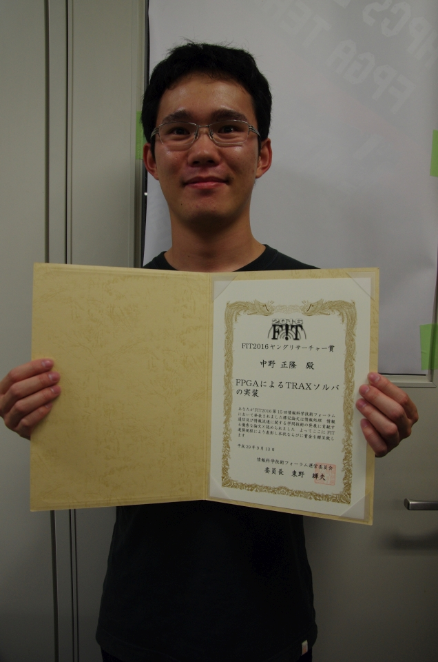

import Lang from "@components/i18n/Lang.astro";

<Lang>
<Fragment slot="ja">

本研究室学生の中野（博士前期2年）が[FIT2016 第15回情報科学技術フォーラム](http://www.ipsj.or.jp/event/fit/fit2016/)にて発表した論文が[FITヤングリサーチャー賞](http://www.ipsj.or.jp/award/fit-young.html)を受賞しました.

> “FPGAによるTRAXソルバの実装”  
> 中野正隆, 山口佳樹（筑波大学）

</Fragment>
<Fragment slot="en">

A paper presented by Nakano (second-year master's student) of our laboratory at [FIT2016, the 15th Forum on Information Technology](http://www.ipsj.or.jp/event/fit/fit2016/) received the [FIT Young Researcher Award](http://www.ipsj.or.jp/award/fit-young.html).

> “Implementation of a TRAX Solver on an FPGA”  
> Masataka Nakano, Yoshiki Yamaguchi (University of Tsukuba)

</Fragment>
</Lang>
