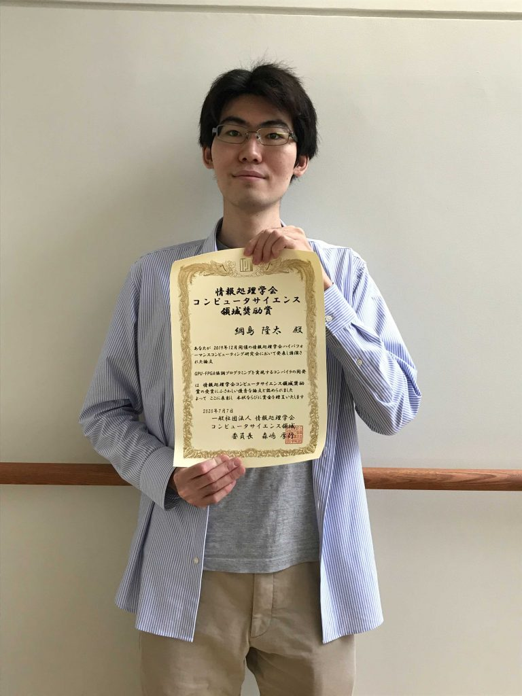

import Lang from "@components/i18n/Lang.astro";

<Lang>
<Fragment slot="ja">

本研究室学生の綱島（博士後期課程2年）が第172回HPC研究会 にて発表した論文が2020年度コンピュータサイエンス領域奨励賞を受賞し、5月14日の第179回HPC研究会 にて表彰されました。

> “GPU-FPGA協調プログラミングを実現するコンパイラの開発”  
> 綱島隆太，小林諒平，藤田典久，中道安祐未，朴泰祐（筑波大学），Lee Seyong，Vetter Jeffrey（米国オークリッジ国立研究所），村井均，佐藤三久（理研）

論文は[こちら](https://ipsj.ixsq.nii.ac.jp/ej/?action=pages_view_main&active_action=repository_view_main_item_detail&item_id=201016&item_no=1&page_id=13&block_id=8)

表彰の詳細については[こちら](https://www.ipsj.or.jp/award/cs-awardee-2020.html)を参照してください。

</Fragment>
<Fragment slot="en">

A paper presented by Tsunashima (second-year doctoral student) of our laboratory at the 172nd HPC research group meeting received the FY2020 IPSJ Computer Science Research Award for Young Scientists, and the award was presented at the 179th HPC research group meeting on May 14.

> “Development of a Compiler for GPU-FPGA Cooperative Programming”  
> Ryuta Tsunashima, Ryohei Kobayashi, Norihisa Fujita, Ayumi Nakamichi, Taisuke Boku (University of Tsukuba), Seyong Lee, Jeffrey Vetter (Oak Ridge National Laboratory, USA), Hitoshi Murai, Mitsuhisa Sato (RIKEN)

The paper is available [here](https://ipsj.ixsq.nii.ac.jp/ej/?action=pages_view_main&active_action=repository_view_main_item_detail&item_id=201016&item_no=1&page_id=13&block_id=8)

Please see [here](https://www.ipsj.or.jp/award/cs-awardee-2020.html) for details of the award.

</Fragment>
</Lang>
