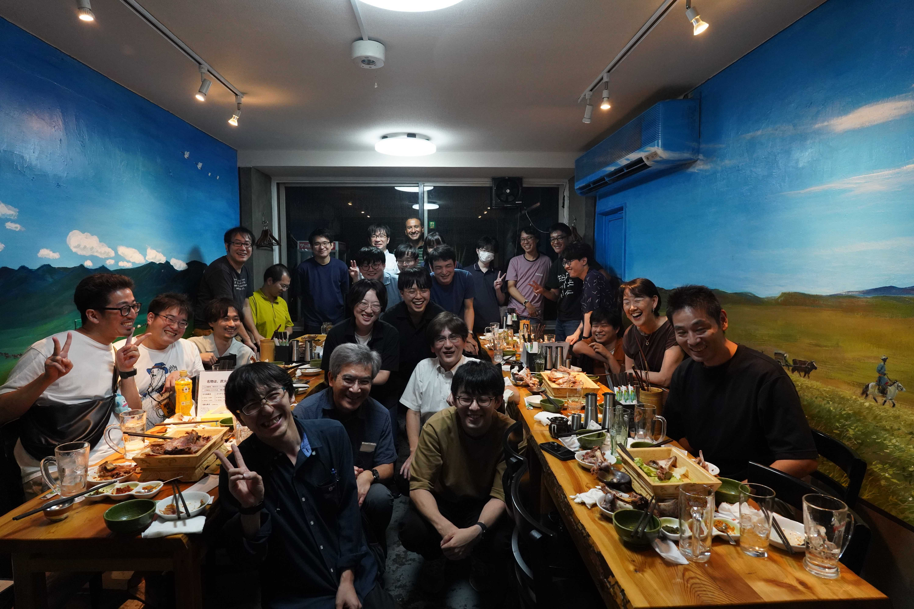

---
cover:
  src: ./cover/ss_2024_summer.jpg
  alt: 集合写真
  alt_en: Group photo
icon: "material-symbols:home-storage-outline-rounded"
name: System Software
color: hsl(300, 77%, 29%)
description: システムソフトウェア，特に並列ファイルシステムや DBMS など，並列分散システムに関わる基盤ソフトウェアの研究を行っています
description_en: We conduct research on system software, in particular the infrastructure software behind parallel and distributed systems, such as parallel file systems and DBMSs.
bachelorInfo:
  capacities:
    - faculties:
        - tatebe
      capacity: 3
  informationSessions:
    - day: 2025-10-15
      hour:
        begin: "15:15"
        end: "17:00"
      place:
        display: 総合研究棟B 1222
        canonical: 筑波大学 総合研究棟B 1222
    - day: 2025-10-20
      hour:
        begin: "13:45"
        end: "15:00"
      place:
        display: 3A405
        canonical: 筑波大学 3A405
    - day: 2025-10-24
      hour:
        begin: "18:15"
        end: "20:00"
      place:
        display: 総合研究棟B 1222
        canonical: 筑波大学 総合研究棟B 1222

recentWorks:
  - 2023/sc23koyama
  - 2023/rexio2023tatebe
  - 2023/rexio2023koyama
  - 2022/icpp-ws2022boku
  - 2022/adopt22koyama
  - 2022/essa22tatebe
  - 2022/hpcasia2022tatebe
  - 2023/swopp2023tatebe
  - 2023/ipsj-hpc190koyama
  - 2022/ipsj-hpc186kasai
  - 2022/ipsj-hpc185hiraga
  - 2022/ipsj-hpc185tatebe
  - 2022/ipsj-hpc185obata
  - 2022/ipsj-hpc184obata
  - 2022/ipsj-hpc183hiraga
  - 2022/ipsj-hpc183tatebe
---

import Keyword from "@components/display/Keyword.astro";
import Chevron from "@components/display/list/item/Chevron.astro";
import Typography from "@components/display/Typography.astro";
import Youtube from "@components/display/Youtube.astro";
import h2 from "@components/composite/heading/h2.astro";
import InlineLink from "@components/display/inline-link.astro";
import YoutubeContainer from "@components/layout/YoutubeContainer.astro";
import Lang from "@components/i18n/Lang.astro";

export const components = {
  p: Typography,
  li: Chevron,
  strong: Keyword,
  h2,
  a: InlineLink,
};

<Lang>
<Fragment slot="ja">

## 建部修見教授

- HPC・ビッグデータ・AIのための並列分散システムソフトウェアに関する研究

超大規模ビッグデータ解析，データインテンシブコンピューティング，
ハイパフォーマンスコンピューティングのためのシステムソフトウェアの研究を行っています．

より大規模なデータを扱うためには，データ規模，コンピュータの計算速度に応じたスケーラブルなI/Oの
仕組みが必要になります．
そのために，分散ファイルシステム，並列I/O，アプリケーションフレームワークなどスケールアウトする
並列分散システムソフトウェアの研究を行っています．

HPC用大規模PCクラスタ、筑波大学のスーパーコンピュータPegasus, 東京大学と共同で運用されているMiyabi等を利用して研究を進めて
います。

- アドホックファイルシステムの研究（[CHFS](https://github.com/otatebe/chfs),
  [FINCHFS](https://github.com/tsukuba-hpcs/finchfs)）

スーパーコンピュータでは、並列ファイルシステムの性能と演算性能のギャップを埋めるため、
計算ノードのローカルストレージを用いて一時的に並列ファイルシステムを構築する
アドホックファイルシステムが有望視されています。

アドホックファイルシステムとして、CHFS、FINCHFS を開発しています。CHFS は
I/O性能の世界ランキングIO500の[2023年6月の10ノード研究部門](https://io500.org/list/isc23/ten)
において21位となりました。

<YoutubeContainer>
  <Youtube
    src="https://www.youtube.com/embed/K6sO66kAkJ8"
    title="CHFS: Parallel Consistent Hashing File System for Node-local Persistent Memory"
  />
</YoutubeContainer>

- キャッシングファイルシステムの研究（CHFS/Cache）

アドホックファイルシステムはノードローカルストレージを用いた一時的な並列ファイルシステム
ですが、並列ファイルシステムとの間のデータ移動を行う必要があります。このデータ移動を
自動的に行う仕組みとしてキャッシングファイルシステムがあります。

CHFS をキャッシングファイルシステムに対応させたシステムとして CHFS/Cache を開発しています。
従来のキャッシングファイルシステムでは、小さいファイルのアクセス性能が低い問題がありましたが、
CHFS/Cache では、並列ファイルシステムとの間の一貫性の条件を緩和することによりその問題解決を
図りました。

<YoutubeContainer>
  <Youtube
    src="https://www.youtube.com/embed/cHJ78vycAms"
    title="Caching Support for CHFS Node-local Persistent Memory File System"
  />
</YoutubeContainer>
また、書換えたデータを並列ファイルシステムにフラッシュすると性能低下する問題もありましたが、
その問題については I/O-Aware フラッシング機構を提案することで解決を図りました。

- 並列I/Oライブラリの研究

アドホックファイルシステムなどはユーザレベルで実装されており、各種アプリケーションから利用
するためには工夫が必要となります。アプリケーションを無修正で利用することができるよう、
MPI-IO、HDF5、Apache Arrow、TensorStore などのライブラリを拡張して、それらのライブラリ
を利用するアプリケーションは無修正で利用できるようにする取り組みを進めています。

アプリケーションのI/Oの性能をより改善するための様々な工夫をしています。

- 次期フラグシップマシンのストレージシステム調査研究

富岳の次の次期フラグシップマシンのストレージシステムの調査研究を進めています。以下はその中間報告です。

<YoutubeContainer>
  <Youtube
    src="https://www.youtube.com/embed/W2AUqhQJ8uk"
    title="次期フラグシップマシンのストレージシステム調査研究の中間報告"
  />
</YoutubeContainer>

- Gfarmファイルシステム

広域分散ファイルシステムとして[Gfarmファイルシステム](http://oss-tsukuba.org/software/gfarm)を
研究開発しています。
Gfarmファイルシステムは、インターネット経由で安全にアクセスが可能で、ストレージを広域に分散でき、
性能・容量がスケールアウトし、単一障害点がなく、データ完全性を保証し、サイレントデータ障害にも
対応可能なストレージシステムです。

GfarmはHPCI共用ストレージなどで実運用されています。HPCI共用ストレージは文部科学省がすすめる
富岳を中核とした国内のHPC基盤で利用される広域ストレージシステムで、全国のスーパーコンピュータ
センターをはじめどこからでもマウントして利用可能なファイルシステムです。ファイルは自動的に
東拠点（柏）と西拠点（神戸）に複製され、障害が発生してもアクセス可能です。

<YoutubeContainer>
  <Youtube
    src="https://www.youtube.com/embed/dvFO3XhU0tU"
    title="Gfarmファイルシステムの最新機能"
  />
</YoutubeContainer>

## 日常生活

- ミーティングを対面で行っています. チームミーティングは週に一回, 全体ミーティングは月に一回程です.
- チーム内での輪講も行っています。今年は [_Architecture and Design of the Linux Storage Stack_](https://www.packtpub.com/product/architecture-and-design-of-the-linux-storage-stack/9781837639960) を読んでいます。
- コアタイムはありません
- 研究室は平日午後は平均で2~3人くらい人がいます
- 研究室内には, 電子レンジ, 冷蔵庫, 電気ポット, コーヒーメーカー,ソファ等の備品もあり, 所属している学生は自由に使用することができます.また，物販もあり，軽食・飲み物等が購入可能です．
- 4年生は3月のHPC研究会で口頭発表することが目標です。もちろん進捗が早い場合は国際会議で発表できます
  - 昨年度は一名四年生がトップカンファレンスであるSC24のPoster sessionでの発表を行いました
- 実装合宿、OBOG会など楽しいイベントがいくつかあります
  - 下記写真は昨年度のOBOG会です

## 研究室の計算リソースと運用サービス

- Intel Optane persistent memory搭載ノードが7台ほどあります
- Infiniband搭載ノードが40台近く、400 Gbps出るノードが2台あります
- チーム独自のノードはサービス運用用含めて70台ほどあり、全て`root`が取れます。
- CCSにあるクラスタと研究室は10G回線で接続されています

多くのroot権限を取れる実験用ノードがあり、カーネルの差し替えも出来るので多彩な研究が可能です。
root権限が不要であれば筑波大学のCygnus、Pegasusスーパーコンピューターも利用できますし、
教員と相談して他大学のスーパーコンピューターを利用することもあります。

チームの運用している共有ファイルシステム、DNSなどの運用はチーム内の有志が修士学生を中心に行っています。
研究室全体のWebサービスやDNS運用はadmin係の担当となっています。
どちらも全員の義務ではないので研究に集中して成果を出すのも、研究をしつつ運用経験を積むのも自由です。

</Fragment>
<Fragment slot="en">

## Professor Osamu Tatebe

- Research on parallel and distributed system software for HPC, big data and AI

We conduct research on system software for very large-scale big data analysis, data-intensive computing
and high performance computing.

Handling ever larger data requires an I/O mechanism that scales with both the size of the data and the
computing speed of the machine.
To that end we study parallel and distributed system software that scales out, including distributed file systems,
parallel I/O and application frameworks.

Our research uses large-scale PC clusters for HPC, Pegasus (the University of Tsukuba's supercomputer), Miyabi (operated jointly with the University of Tokyo)
and other systems.

- Research on ad hoc file systems ([CHFS](https://github.com/otatebe/chfs),
  [FINCHFS](https://github.com/tsukuba-hpcs/finchfs))

On supercomputers, ad hoc file systems — which build a temporary parallel file system out of the local storage
of the compute nodes — are seen as a promising way to close the gap between the performance of the
parallel file system and that of the computation itself.

We are developing CHFS and FINCHFS as ad hoc file systems. CHFS ranked 21st in the
[10-node research category of the June 2023 edition](https://io500.org/list/isc23/ten) of IO500,
the world ranking of I/O performance.

<YoutubeContainer>
  <Youtube
    src="https://www.youtube.com/embed/K6sO66kAkJ8"
    title="CHFS: Parallel Consistent Hashing File System for Node-local Persistent Memory"
  />
</YoutubeContainer>

- Research on caching file systems (CHFS/Cache)

An ad hoc file system is a temporary parallel file system built on node-local storage, and data must therefore
be moved between it and the underlying parallel file system. A caching file system is a mechanism that
performs this data movement automatically.

We are developing CHFS/Cache, a version of CHFS that works as a caching file system.
Conventional caching file systems suffer from poor performance when accessing small files;
in CHFS/Cache we address this problem by relaxing the consistency requirements between the cache and the
parallel file system.

<YoutubeContainer>
  <Youtube
    src="https://www.youtube.com/embed/cHJ78vycAms"
    title="Caching Support for CHFS Node-local Persistent Memory File System"
  />
</YoutubeContainer>
There was also a problem of degraded performance when flushing modified data
back to the parallel file system, which we address by proposing an I/O-aware
flushing mechanism.

- Research on parallel I/O libraries

Ad hoc file systems and similar software are implemented at user level, so some effort is needed before
applications can use them. So that applications can be used without modification, we are extending
libraries such as MPI-IO, HDF5, Apache Arrow and TensorStore, so that any application built on those
libraries works unchanged.

We are also devising a variety of techniques to further improve the I/O performance of applications.

- Study of the storage system for the next flagship machine

We are studying the storage system for the flagship machine that will succeed Fugaku. The following is an interim report.

<YoutubeContainer>
  <Youtube
    src="https://www.youtube.com/embed/W2AUqhQJ8uk"
    title="Interim report on the study of the storage system for the next flagship machine"
  />
</YoutubeContainer>

- The Gfarm file system

We research and develop the [Gfarm file system](http://oss-tsukuba.org/software/gfarm) as a
wide-area distributed file system.
Gfarm is a storage system that can be accessed securely over the Internet, can distribute storage across
wide areas, scales out in both performance and capacity, has no single point of failure, guarantees data
integrity, and can cope with silent data corruption.

Gfarm is in production use in systems such as the HPCI shared storage. The HPCI shared storage is a wide-area
storage system used across the domestic HPC infrastructure centred on Fugaku, which is promoted by MEXT;
it can be mounted and used from anywhere, including supercomputer centres throughout Japan. Files are
automatically replicated to the eastern site (Kashiwa) and the western site (Kobe), so they remain accessible
even when a failure occurs.

<YoutubeContainer>
  <Youtube
    src="https://www.youtube.com/embed/dvFO3XhU0tU"
    title="The latest features of the Gfarm file system"
  />
</YoutubeContainer>

## Everyday life in the team

- Meetings are held in person. Team meetings are weekly, and the whole-laboratory meeting is roughly monthly.
- We also hold a reading group within the team. This year we are reading [_Architecture and Design of the Linux Storage Stack_](https://www.packtpub.com/product/architecture-and-design-of-the-linux-storage-stack/9781837639960).
- There are no core hours.
- On weekday afternoons there are typically two or three people in the laboratory.
- The laboratory is equipped with a microwave oven, a refrigerator, an electric kettle, a coffee maker, sofas and so on, all of which students are free to use. Snacks and drinks are also on sale on site.
- The goal for fourth-year undergraduates is to give an oral presentation at the HPC research meeting in March. Of course, if progress is fast, they can present at an international conference.
  - Last year one fourth-year student presented in the poster session of SC24, a top-tier conference.
- There are a number of enjoyable events, such as the implementation camp and the alumni gathering.
  - The photograph below is from last year's alumni gathering.

## Computing resources and operational services of the laboratory

- We have about seven nodes equipped with Intel Optane persistent memory.
- We have close to forty nodes with InfiniBand, two of which reach 400 Gbps.
- Including the nodes used to run services, the team has about seventy of its own nodes, and `root` is available on all of them.
- The cluster at the Center for Computational Sciences and the laboratory are connected by a 10G link.

Because we have many experimental nodes on which root privileges are available and even the kernel can be replaced, a wide range of research is possible.
When root privileges are not required, the University of Tsukuba's Cygnus and Pegasus supercomputers are also available,
and after discussion with the faculty we sometimes use supercomputers at other universities as well.

The shared file system, DNS and other services run by the team are operated by volunteers within the team, mainly master's students.
Web services and DNS operation for the whole laboratory are handled by the admin group.
Neither is compulsory, so you are free either to concentrate on research and produce results, or to gain operational experience alongside your research.

</Fragment>
</Lang>
