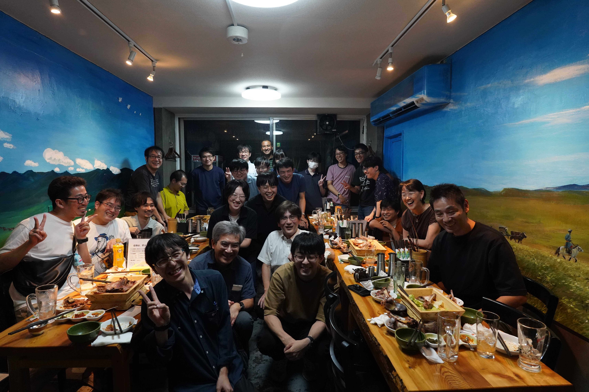

---
cover:
  src: ./cover/ss_2024_summer.jpg
  alt: 集合写真
icon: "material-symbols:home-storage-outline-rounded"
name: System Software
color: hsl(300, 77%, 29%)
description: システムソフトウェア，特に並列ファイルシステムや DBMS など，並列分散システムに関わる基盤ソフトウェアの研究を行っています
bachelorInfo:
  capacities:
    - faculties:
        - tatebe
      capacity: 3
  informationSessions:
    - day: 2024-10-03
      hour:
        begin: "15:15"
        end: "17:00"
      place:
        display: 総合研究棟B 1222
        canonical: 筑波大学 総合研究棟B 1222
    - day: 2023-10-11
      hour:
        begin: "18:15"
        end: "19:30"
      place:
        display: 総合研究棟B 1222
        canonical: 筑波大学 総合研究棟B 1222
    - day: 2023-10-21
      hour:
        begin: "13:45"
        end: "15:00"
      place:
        display: 3A405(分散システム後)
        canonical: 筑波大学 3A405

recentWorks:
  - 2023/sc23koyama
  - 2023/rexio2023tatebe
  - 2023/rexio2023koyama
  - 2022/icpp-ws2022boku
  - 2022/adopt22koyama
  - 2022/essa22tatebe
  - 2022/hpcasia2022tatebe
  - 2023/swopp2023tatebe
  - 2023/ipsj-hpc190koyama
  - 2022/ipsj-hpc186kasai
  - 2022/ipsj-hpc185hiraga
  - 2022/ipsj-hpc185tatebe
  - 2022/ipsj-hpc185obata
  - 2022/ipsj-hpc184obata
  - 2022/ipsj-hpc183hiraga
  - 2022/ipsj-hpc183tatebe
---

import Keyword from "@components/display/Keyword.astro";
import Chevron from "@components/display/list/item/Chevron.astro";
import Typography from "@components/display/Typography.astro";
import Youtube from "@components/display/Youtube.astro";
import h2 from "@components/composite/heading/h2.astro";
import InlineLink from "@components/display/inline-link.astro";
import YoutubeContainer from "@components/layout/YoutubeContainer.astro";

export const components = {
  p: Typography,
  li: Chevron,
  strong: Keyword,
  h2,
  a: InlineLink,
};

## 建部修見教授

- HPC・ビッグデータ・AIのための並列分散システムソフトウェアに関する研究

超大規模ビッグデータ解析，データインテンシブコンピューティング，
ハイパフォーマンスコンピューティングのためのシステムソフトウェアの研究を行っています．

より大規模なデータを扱うためには，データ規模，コンピュータの計算速度に応じたスケーラブルなI/Oの
仕組みが必要になります．
そのために，分散ファイルシステム，並列I/O，アプリケーションフレームワークなどスケールアウトする
並列分散システムソフトウェアの研究を行っています．

HPC用大規模PCクラスタ、筑波大学のスーパーコンピュータPegasus、Cygnus等を利用して研究を進めて
います。

- アドホックファイルシステムの研究（[CHFS](https://github.com/otatebe/chfs),
  [FINCHFS](https://github.com/tsukuba-hpcs/finchfs)）

スーパーコンピュータでは、並列ファイルシステムの性能と演算性能のギャップを埋めるため、
計算ノードのローカルストレージを用いて一時的に並列ファイルシステムを構築する
アドホックファイルシステムが有望視されています。

アドホックファイルシステムとして、CHFS、FINCHFS を開発しています。CHFS は
I/O性能の世界ランキングIO500の[2023年6月の10ノード研究部門](https://io500.org/list/isc23/ten)
において21位となりました。

<YoutubeContainer>
  <Youtube
    src="https://www.youtube.com/embed/K6sO66kAkJ8"
    title="CHFS: Parallel Consistent Hashing File System for Node-local Persistent Memory"
  />
</YoutubeContainer>

- キャッシングファイルシステムの研究（CHFS/Cache）

アドホックファイルシステムはノードローカルストレージを用いた一時的な並列ファイルシステム
ですが、並列ファイルシステムとの間のデータ移動を行う必要があります。このデータ移動を
自動的に行う仕組みとしてキャッシングファイルシステムがあります。

CHFS をキャッシングファイルシステムに対応させたシステムとして CHFS/Cache を開発しています。
従来のキャッシングファイルシステムでは、小さいファイルのアクセス性能が低い問題がありましたが、
CHFS/Cache では、並列ファイルシステムとの間の一貫性の条件を緩和することによりその問題解決を
図りました。

<YoutubeContainer>
  <Youtube
    src="https://www.youtube.com/embed/cHJ78vycAms"
    title="Caching Support for CHFS Node-local Persistent Memory File System"
  />
</YoutubeContainer>
また、書換えたデータを並列ファイルシステムにフラッシュすると性能低下する問題もありましたが、
その問題については I/O-Aware フラッシング機構を提案することで解決を図りました。

- 並列I/Oライブラリの研究

アドホックファイルシステムなどはユーザレベルで実装されており、各種アプリケーションから利用
するためには工夫が必要となります。アプリケーションを無修正で利用することができるよう、
MPI-IO、HDF5、Apache Arrow、TensorStore などのライブラリを拡張して、それらのライブラリ
を利用するアプリケーションは無修正で利用できるようにする取り組みを進めています。

アプリケーションのI/Oの性能をより改善するための様々な工夫をしています。

- 次期フラグシップマシンのストレージシステム調査研究

富岳の次の次期フラグシップマシンのストレージシステムの調査研究を進めています。以下はその中間報告です。

<YoutubeContainer>
  <Youtube
    src="https://www.youtube.com/embed/W2AUqhQJ8uk"
    title="次期フラグシップマシンのストレージシステム調査研究の中間報告"
  />
</YoutubeContainer>

- Gfarmファイルシステム

広域分散ファイルシステムとして[Gfarmファイルシステム](http://oss-tsukuba.org/software/gfarm)を
研究開発しています。
Gfarmファイルシステムは、インターネット経由で安全にアクセスが可能で、ストレージを広域に分散でき、
性能・容量がスケールアウトし、単一障害点がなく、データ完全性を保証し、サイレントデータ障害にも
対応可能なストレージシステムです。

GfarmはHPCI共用ストレージなどで実運用されています。HPCI共用ストレージは文部科学省がすすめる
富岳を中核とした国内のHPC基盤で利用される広域ストレージシステムで、全国のスーパーコンピュータ
センターをはじめどこからでもマウントして利用可能なファイルシステムです。ファイルは自動的に
東拠点（柏）と西拠点（神戸）に複製され、障害が発生してもアクセス可能です。

<YoutubeContainer>
  <Youtube
    src="https://www.youtube.com/embed/dvFO3XhU0tU"
    title="Gfarmファイルシステムの最新機能"
  />
</YoutubeContainer>

## 日常生活

- コロナウイルスが収束しつつあるため、ミーティングが対面になりました.チームミーティングは週に一回, 全体ミーティングは月に一回程です.
- チーム内での輪講も行っています。今年は [_Architecture and Design of the Linux Storage Stack_](https://www.packtpub.com/product/architecture-and-design-of-the-linux-storage-stack/9781837639960) を読んでいます。
- コアタイムはありません
- 研究室は平日午後は平均で2~3人くらい人がいます
- 研究室内には, 電子レンジ, 冷蔵庫, 電気ポット, コーヒーメーカー,ソファ等の備品もあり, 所属している学生は自由に使用することができます.また，物販もあり，軽食・飲み物等が購入可能です．
- 4年生は3月のHPC研究会で口頭発表することが目標です。もちろん進捗が早い場合は国際会議で発表できます
  - 本年度は一名四年生がトップカンファレンスであるSC24のPoster sessionでの発表を行います
- 実装合宿、OBOG会など楽しいイベントがいくつかあります
  - 下記写真は本年度のOBOG会です

## 研究室の計算リソースと運用サービス

- Intel Optane persistent memory搭載ノードが7台ほどあります
- Infiniband搭載ノードが40台近く、400 Gbps出るノードが2台あります
- チーム独自のノードはサービス運用用含めて70台ほどあり、全て`root`が取れます。
- CCSにあるクラスタと研究室は10G回線で接続されています

多くのroot権限を取れる実験用ノードがあり、カーネルの差し替えも出来るので多彩な研究が可能です。
root権限が不要であれば筑波大学のCygnus、Pegasusスーパーコンピューターも利用できますし、
教員と相談して他大学のスーパーコンピューターを利用することもあります。

チームの運用している共有ファイルシステム、DNSなどの運用はチーム内の有志が修士学生を中心に行っています。
研究室全体のWebサービスやDNS運用はadmin係の担当となっています。
どちらも全員の義務ではないので研究に集中して成果を出すのも、研究をしつつ運用経験を積むのも自由です。
